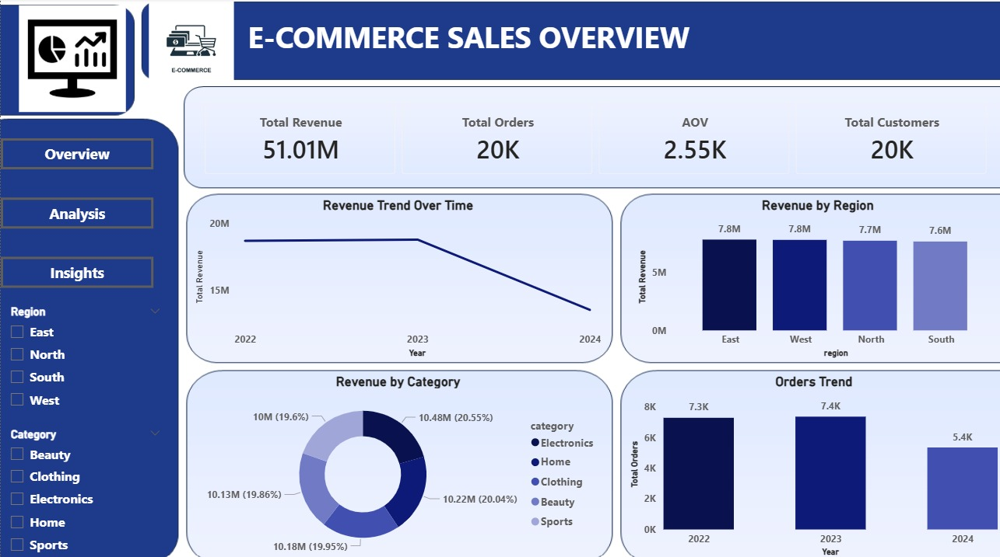
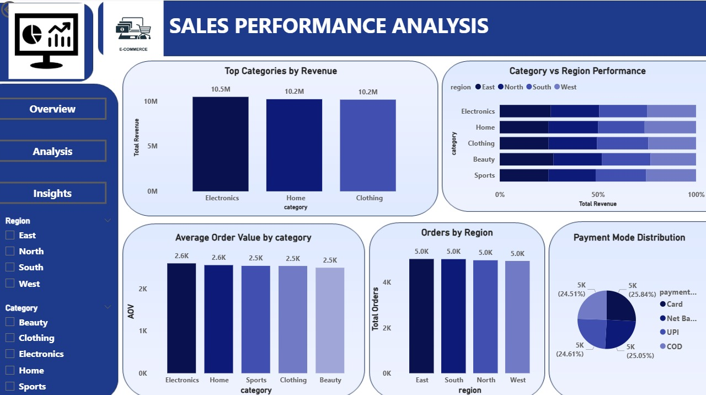
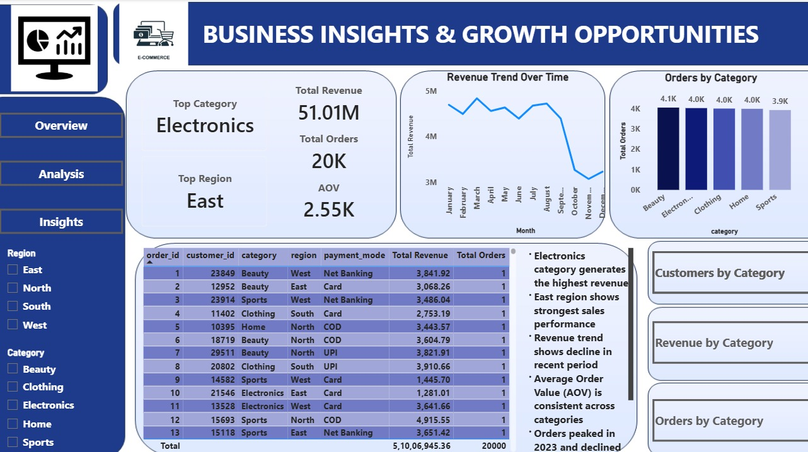

# E-Commerce Analytics Dashboard

## Project Overview
This project analyzes e-commerce data to understand sales performance, customer behavior, and product trends using SQL and Power BI.

## Objectives
- Analyze sales trends and revenue performance
- Identify high-performing products and categories
- Understand customer purchasing behavior
- Support business growth through data insights

## Key Insights
- Identified top-selling products and revenue-driving categories
- Analyzed customer purchase patterns and repeat behavior
- Highlighted trends in sales performance over time
- Provided insights to improve marketing and sales strategies

## Tools Used
- SQL (data analysis)
- Power BI (dashboard creation)

## Process
- Collected and prepared e-commerce dataset
- Queried and analyzed data using SQL
- Performed customer segmentation analysis
- Created interactive Power BI dashboards for KPIs and insights

## Dashboard Preview

